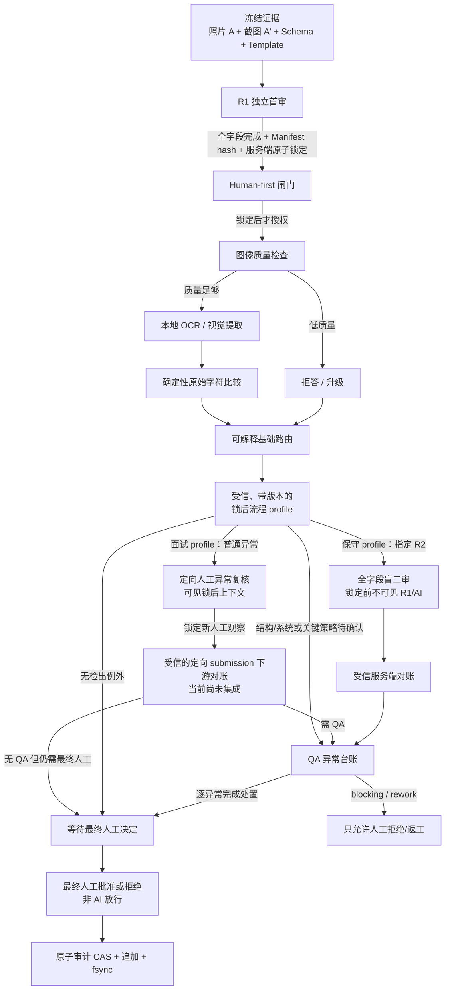

# ParamGuard Vision 架构设计

| 字段 | 值 |
|---|---|
| 文档状态 | 个人学习 PoC 的实现架构，非生产资格认证 |
| 版本 | 0.1 |
| 日期 | 2026-08-25 |
| 默认模式 | `STRICT_SEQUENTIAL` |

## 1. 架构目标

ParamGuard Vision 将“人必须先独立核对”实现为服务端状态约束，而不是只在界面上隐藏一个按钮。项目同时分离三类职责：

- 人工负责首次独立观察、锁后 profile 指定的复核、QA 处置和最终决定；
- OCR/视觉模型只负责辅助提取和表达不确定性；
- 普通、可重复的确定性代码负责原始字符比较、结构检查和保守路由。

`EXACT_MATCH` 只表示两个非空原始字符串逐字符一致，不表示数值合法、工艺正确或可以放行。

## 2. 信任边界和主流程



主要信任边界有：

1. **R1 可达边界**：在锁定前只能读取冻结证据、预期字段、本人已作答和完整性信息。不应返回 AI run 是否存在、进度、置信度、路由、风险颜色或任何可推断先验结果的元数据。
2. **AI 执行边界**：图像适配器必须先验证 `AI_REVIEW_RUNNING`、run ID、Manifest hash 和批准的 PipelineSpec hash，然后才读取图像字节。
3. **profile/定向复核边界**：客户端不能自报 profile、异常列表或关键性/质量/结构信号。服务端必须通过可信 resolver 取得锁定上下文，并从 R1/AI/确定性比较重算队列。
4. **R2 盲审边界**：仅当受信 profile 选择该路径时启用。R2 packet 只含冻结原证据和全量 Schema；独立模块不导入 R1 workflow 或 routing，以减少无意泄漏。
5. **QA/仲裁边界**：只有受信服务端可将已锁定 R1、已完成 AI、profile/路由事实和可选已锁定人工复核合并；不接受客户端自由提交的异常列表。当前仲裁 aggregate 只已连接直达 QA 与条件性盲 R2 路径，定向 submission 的下游合并仍是待实现边界。
6. **审计存储边界**：哈希链只能检测修改，不能单独证明最初事件合法。因此写入时还必须做强类型 schema 检查和全链语义重放。

## 3. 核心组件

| 组件 | 当前实现 | 唯一允许的职责 | 明确不拥有的权限 |
|---|---|---|---|
| 证据清单 | `evidence.py` | 冻结两个证据对象、Schema、模板、字节长度和 SHA-256 | 不判断图像真实性或业务合法性 |
| 首审状态机 | `workflow.py` | 收集/修订 R1 决定、完整锁定、严格控制 AI 执行顺序 | 不做 QA 处置或放行 |
| 固定模板 | `template.py` | 冻结 ROI 坐标、字段顺序和关键性标记 | 不动态猜测未知界面 |
| 合成证据 | `synthetic.py` | 生成虚构照片/截图和受控降质样本 | 不代表真实工厂数据分布 |
| 图像质量门 | `image_quality.py` | 用版本化透明启发式拒答/升级 | 不批准任何字段 |
| 本地 OCR | `ocr.py` | 从固定 ROI 提取原始文本、token、框和 confidence，记录版本 | 不决定一致、合法或放行 |
| 管道身份 | `pipeline.py` | 将 OCR、质量阈值、模板、比较和路由版本绑定为内容哈希 | 不允许请求自由替换版本 |
| 视觉管道 | `vision_pipeline.py` | 锁后验证证据、质量检查、OCR、确定性比较、路由 | 不得在锁前读取证据生成 AI 线索 |
| 保守路由 | `routing.py` | 将关键性、差异、不确定、质量或结构问题升级 | `NO_EXCEPTION_DETECTED` 仍不是批准 |
| 锁后流程 profile | `review_policy.py` | 将基础 route 确定性映射到定向复核、全字段盲 R2、QA 或最终人工确认 | 不是客户端可修改建议，不自动放行 |
| 定向异常复核 | `targeted_review.py` | 从已完成 ReviewTask 和可信锁定上下文重算异常队列，记录并锁定新人工观察 | 不接受客户端自报队列，不关闭异常或放行 |
| 盲二审 | `blind_review.py` | 当 profile 指定时，强制独立身份、全字段盲作答、修订历史和原子锁定 | 不读 R1/AI/routing，不是面试档案的默认路径 |
| QA/仲裁 | `adjudication.py` | 重算路由、受信解析 R2、构建异常台账、逐项处置、最终人工闸门 | 目前仅连接已完成的盲 R2/直达 QA 路径，定向复核尚未接入 |
| 授权核心 | `policy.py` | deny-by-default 的强类型 action/phase/state/actor/任务/分配绑定判定 | 尚未接入全部 Web/API，不替代 IAM/电子签名 |
| 可选 VLM challenger | `vlm.py` | 仅锁后对经 allowlist 的可重建合成图提供 observation/abstain，再由本地规则比较 | 默认禁网，不改 OCR/R1/路由，不处理真实公司图 |
| 配准合同 | `registration.py` | 验证矩阵、几何、冻结绑定和全 ROI 可见性，不合格时拒答 | 没有真实 OpenCV adapter，尚未接入主管道 |
| 审计 | `audit.py`, `audit_adapter.py` | 强类型追加事件、证据/run 绑定、语义重放、final CAS+fsync | JSONL 不是 WORM、数字签名或受信时间戳 |
| 本地 Web | `webapp.py`, `static/paramguard.html` | 实际操作 R1→锁定→本地 OCR→定向 inbox/作答/锁定，并在锁前保持专用 allowlist | 全字段盲 R2、QA disposition、final、追加审计、真实认证和持久事务尚未连接；1001 项初始 DTO/DOM 仍较大 |
| 评估 | `benchmark.py`, `benchmark_runner.py`, `evaluation.py` | 冻结切分、实际走 human-first 管道、报告风险指标 | 不将合成测试外推到工厂 |

## 4. 证据绑定链

设计目标中的一条完整、可重建任务链至少应绑定以下身份。当前模块已经分别实现这些绑定的主要片段，但定向复核的 submission → 审计/QA/final 尚未贯通；所以下列内容是目标证据链，而不是当前 Web 已经拥有的一条统一持久记录：

```text
task_id
  -> EvidenceManifest hash
       -> LEFT_PHOTO bytes + SHA-256
       -> RIGHT_SCREENSHOT bytes + SHA-256
       -> Schema ID/version/content SHA-256
       -> Template ID/version/content SHA-256
  -> approved PipelineSpec hash
       -> OCR engine/version/config SHA-256
       -> quality config SHA-256
       -> comparator/routing/pipeline version
  -> R1 decisions + reviewer + server time + manifest hash
  -> AI run + raw extraction + comparison + refusal reason
  -> routing facts
  -> approved review profile + locked routing-context hash
  -> optional locked targeted-recheck submission hash
  -> optional locked R2 submission hash
  -> QA exception ledger + dispositions + resolution digest
  -> final human actor + rationale + current audit predecessor
```

内容哈希可以检出“同一版本号下内容被静默替换”，但不能自动证明输入来源可信。真实系统仍需要受信身份、权限、存储、签名、时间和变更管理。

自管道 1.6 起，视觉处理、Web 质量复核和人工原图/ROI 使用同一证据读取方法：单次打开文件，
每次最多读取 64 KiB，累计最多读取冻结长度 N 加一字节；多出的一字节仅用于检测增长。
短读会继续，只有空 bytes 表示 EOF；无效读取结果、提前 EOF、额外内容或摘要不符均拒绝。
读取不依赖 stat 后重开；原始 bytes 通过长度和 SHA-256 校验后才交给后续消费者。
人工查看原图/ROI 仍可发生在 R1 锁前，但这条读取路径不执行 AI、质量或路由计算。

自管道 1.5 起，锁后在解码前核对图像头部尺寸。尺寸与冻结模板不符时，直接返回
`DIMENSION_MISMATCH`，不解码像素、不做灰度或边缘统计，也不运行 OCR。
此时两项质量指标为 `None`（未测量），不是零分；全字段仍拒答并进入人工处理。
匹配尺寸的图像继续使用原有质量阈值。旧管道 1.6 及更早的任务不能静默使用当前 1.7 实现。

这是相对冻结长度的读取上限和尺寸不符分支的提前拒绝，不是完整资源隔离。
64 KiB 是读取粒度，不是图像总量上限；冻结长度仍须由可信接入流程约束。
文件绝对大小、打开/读取时限、特殊文件与符号链接策略、匹配尺寸图像的解码内存、
附属元数据和整批处理时限仍需单独设定并验证。

管道 1.7 为本地 OCR 增加 `max_output_bytes`：每次进程的 stdout 与 stderr
共享字节预算，默认 1,048,576 bytes。该正整数配置纳入 OCR 与 PipelineSpec 摘要。
默认 POSIX 执行器同时处理二进制输入和两路输出；单次读最多 64 KiB，累计最多读 N+1
字节检测超额。超限立即拒绝，不解码、不解析或发布截断结果；整对图像的部分观察被丢弃，
全部字段作为 SYSTEM_ERROR 进入人工处理。版本查询也受同一单次预算约束。

EOF 后仍须等进程退出；超时、超限和 I/O 失败会关闭管道并终止、回收本次直接子进程。
Windows 默认拒绝执行，不回退到无界捕获。注入 runner 仅在返回后检查长度，不能约束其内部内存。
这是捕获字节限制，不是整个 Python 进程的内存限额，也不限制 Tesseract 的工作内存。
15 秒 timeout 仍针对单次调用，不是整批截止时间；进程创建、内核清理和后代进程隔离不在此保证内。
预算来自受信配置，不是通用业务参数长度标准；单 token、原串和全部字段累计预算仍需独立评估。

## 5. 严格顺序与信息不泄漏

当前唯一允许的 R1/AI 模式是 `STRICT_SEQUENTIAL`。以下是跨 `ReviewTask`、定向复核/盲 R2 和仲裁等多个 aggregate 的概念生命周期，不是声称所有名称都已实现在同一个状态 enum 中：

```text
HUMAN_REVIEW_OPEN
  -> HUMAN_REVIEW_LOCKED
  -> AI_REVIEW_QUEUED
  -> AI_REVIEW_RUNNING
  -> AI_REVIEW_COMPLETE
  -> profile-bound one of:
       TARGETED_REVIEW_OPEN
       FULL_MANIFEST_BLIND_SECOND_REVIEW_OPEN
       QA_DISPOSITION_OPEN
       READY_FOR_FINAL_HUMAN_DECISION
  -> human review/QA completion as required
  -> FINAL_APPROVED or FINAL_REJECTED
```

“没有返回 AI 结果字段”并不足够。R1 界面还要避免以下侧信道：

- 因 AI 结果而改变字段顺序、高亮、默认值、分页或任务排序；
- 返回 AI 已运行/未运行的状态、时长、计数、响应长度或不同错误；
- 用包含结果的 cache key、ETag、URL、日志、WebSocket 或客户端 bundle 提前下发；
- 在前端只用 CSS/JavaScript 隐藏已经下发的结果。

因此第一道边界必须在服务端；界面隐藏只是辅助控制。

## 6. LLM/VLM 的受限位置

可运行主基线仍使用本地 OCR 和确定性代码，**LLM/VLM 没有进入任何放行路径**。项目已实现一个隔离的、可选的 VLM challenger 原型，但有意缩小其权力：

1. 只有 R1 锁定且本地 AI run 完成后才允许构建请求；
2. 只接受经审查 allowlist 的、可重新渲染并按 PNG 字节核对的虚构合成 case；真实公司图片禁止上传；
3. 模型只能返回两侧 observation 或 abstain，不能返回 verdict、route、异常关闭或放行动作；
4. 本地 `compare_values()` 重算字符结果；abstain/解析/网络失败强制缺失比较并 fail closed；
5. 默认禁网，自动测试只使用注入的离线 transport，尚未做真实 API/模型性能验证。

当前实现已固定结构化输出 schema，严格验证 task/R1/run/manifest/pipeline/dataset/config 绑定，并拒绝 tool call、重复 JSON key、超大输入/输出和跨 task 响应重放。`store:false` 不等于零保留或 ZDR；任何真实数据评估都需先完成数据分类、出域、安全/隐私、合同和保留/驻留审批。详见 [LLM_COMPONENT.md](./LLM_COMPONENT.md)。

## 7. PoC 与生产架构差距

当前的 Python 对象、`RLock`、JSONL 和本地文件是为了让逻辑可学习、可测试。生产化至少需要：

- 由身份提供者注入不可伪造 principal/角色，服务端做任务级授权；
- 关系数据库交易、唯一约束、乐观 CAS 和 transactional outbox；
- 独立证据对象存储、受控保留、备份/恢复、WORM 或等效防护评估；
- 受信服务端时间、时钟监控、审计链外部锚定与运行告警；
- 电子签名、签名含义、重认证和签名/记录永久关联（如果真实 intended use 要求）；
- 可验证的部署、配置、监控、漏洞/供应链管理、变更和回退流程；
- 由 Process Owner、System Owner、QA/Validation 和 IT/OT Security 确定真实 SOP、参数关键性、接受标准和残余风险。

本架构用于讲解如何将 human-first 变成系统不变式，不能被包装成企业内部架构或已验证的 GxP 系统。
