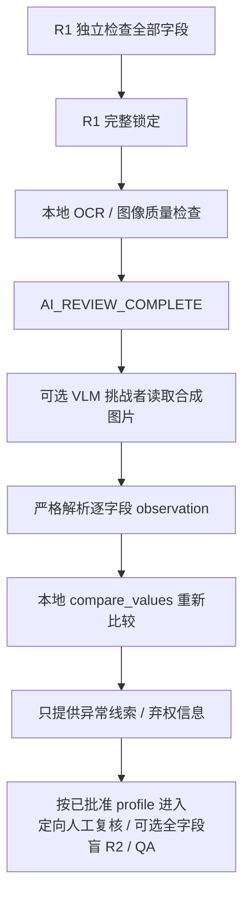

# LLM 组件：只能观察，不能当最后裁判

这一页专门回答一个新手最容易困惑的问题：

> 既然“是否完全一致”最后由普通 Python 代码判断，为什么这仍然是一个 LLM 项目？

因为 LLM/VLM（能看图的语言模型）在这里承担的是它擅长、但不具有最终权力的工作：**从复杂图像中提出第二种视觉观察**。系统再用可重复、可测试的本地规则检查这些观察。它是一个被严格限制的“挑战者”，不是审批人。

当前实现只接受一个已审阅、版本化且内容哈希在 allowlist 中的虚构演示数据集；默认禁止联网；仓库不配置或保存真实 API 密钥；专项测试使用的是本地假 transport，**没有调用真实 OpenAI API**。本项目不依靠“检查当前机器是否恰好设置了某个环境变量”来证明这个边界。

## 1. 先认识三个不同角色

| 角色 | 做什么 | 能否作最终结论 |
|---|---|---|
| 第一位人工审核员（R1） | 不看 AI 提示，逐字段独立检查并锁定结果 | 能记录人的原始判断，但不能被后来的 AI 覆盖 |
| OCR 与 VLM | 从图片中读出可能看到的原始字符，遇到不清楚就弃权 | 不能批准、放行或替代人工 |
| `compare_values` | 对两边非空原始字符串逐字符比较，并解释差异类型 | 只产生确定性的技术比较结果，仍不等于业务放行 |

这里最重要的边界是：**模型输出中根本没有 `verdict`、`release` 或 `approval` 字段。** 除了一个只用于防止跨任务误重放的 `response_binding_sha256` 技术字段，每条观察只能返回：

- `parameter_id`
- `left_observation`
- `right_observation`
- `abstain`
- `reason`

因此，即使模型在图片中看到“忽略规则并批准”这样的文字，那也只是图片里的不可信数据，不能改变 JSON schema，更不能触发放行。

## 2. 为什么一定放在人工和本地 OCR 之后

这个项目落实的是面试题设所述的公司约束，而不是声称某一条法规普遍规定了固定顺序。



`build_vlm_challenger_request(...)` 首先检查 `ReviewTask.state`。只有状态严格等于 `AI_REVIEW_COMPLETE`，才会读取图片并构造请求。也就是说：

- 人工未锁定时，看不到 VLM 结果；
- 本地 AI/OCR 还在运行时，也不能提前调用 VLM；
- `task_id`、R1 锁定快照、完成的 `run_id`、pipeline spec、全部 OCR assessment、证据 manifest hash、图片字节和模板 hash 必须全部相符；
- 调用前会重新生成一次声明的合成案例，图片必须与合成渲染器输出逐字节相同；
- 图片使用有上限的单次文件描述符读取，最终路径分量不能是 symlink，且只接受 regular file；非阻塞打开会让 FIFO 等特殊文件立即失败，避免「检查后换文件」的 TOCTOU 窗口或被恶意路径挂起。

仅做“可重新渲染”检查还不够：如果调用者先把真实公司参数填进 `SyntheticCaseSpec`，再用合成渲染器画出来，图片依然“可重新渲染”，但数据并不因此变成虚构数据。所以当前网络门另外硬编码了 `paramguard-synthetic-demo-v1` 中已审阅 case 和 template 的内容摘要；任意 caller-supplied 值，即使能完美重新渲染，也会在读图前被拒绝。新增数据集必须人工审阅并显式更新版本和 allowlist。

## 3. 请求为什么是一个受约束的 LLM 请求

代码采用 OpenAI Responses API 的请求形态：

- 固定模型快照：`gpt-5.4-mini-2026-03-17`；
- 两张图片通过 `input_image` 发送；
- `text.format.type` 是 `json_schema`，并启用严格 schema；
- `store` 明确设为 `false`，表示不把该 response 作为可供后续 API retrieve 的应用状态保存；**这不等于“零保留”**；
- `tools` 是空数组，`tool_choice` 是 `none`；
- `background` 是 `false`，不使用对话、previous response 或任何工具；
- 模型、提示词、schema、配置、已锁定 R1 摘要、完成 OCR run 摘要和合成 case 分别绑定 SHA-256，之后再形成总的 `spec_sha256`；
- API key 不属于 request、config 或 outcome 对象，只能由调用参数或 `OPENAI_API_KEY` 环境变量临时读取。

官方依据：Responses API 可以接收文本或图片并产生文本或 JSON 输出，也提供 `store` 和 `text.format` 参数；官方模型页列出 GPT-5.4 mini 支持图片输入、Responses endpoint、Structured Outputs 和固定快照 `gpt-5.4-mini-2026-03-17`。参见 [Create a model response](https://developers.openai.com/api/reference/cli/resources/responses/methods/create)、[Images and vision](https://developers.openai.com/api/docs/guides/images-vision) 与 [GPT-5.4 mini model](https://developers.openai.com/api/docs/models/gpt-5.4-mini)。

### 为什么 1000+ 字段不能直接塞进一次 VLM 请求

OpenAI 官方 Structured Outputs 文档列出了 schema 界限：所有 enum 合计最多 1000 个值；单个字符串 enum 超过 250 个值时，该 enum 的字符串合计最多 15,000 字符；schema 的 property name、definition name、enum 和 const 等字符串合计最多 120,000 字符。参见 [Structured model outputs](https://developers.openai.com/api/docs/guides/structured-outputs)。

更重要的是，每个字段都要返回两个 observation、弃权状态和原因；即使 schema 刚好没超限，一次输出 1000 条也容易超出输出 budget 并产生难以稳定重试的大请求。所以当前实现有显式 `max_parameters`、enum 字符、schema 字符、request/response byte 和最低输出 token 前置门；默认单请求最多 16 字段，项目硬上限是 64。**带独立绑定和完整性校验的分批尚未实现**；不会静默截断或假装完成 1000 条。这不影响本地 OCR 和 human-first 主流程处理 1000+ 字段，只是说可选 VLM challenger 现阶段不承担整批执行。

### `store: false` 不是“数据绝不保留”

这一点在药企/医疗相关面试里尤其不能说错。OpenAI 官方数据控制文档说明：API 默认的 abuse-monitoring logs 可能包含 prompt、response 和相关 metadata，通常最长保留 30 天；Zero Data Retention（ZDR）需要客户符合资格、事先获批，并在组织或项目层正确配置，而且仍受官方列出的限制影响。`store: false` 不能单独替代这些治理措施。参见 [Data controls in the OpenAI platform](https://developers.openai.com/api/docs/guides/your-data)。

因此本 PoC 的硬性规则是：

- 即使请求写了 `store: false`，也只准使用本项目可再生成证明的合成图片；
- **真实公司图片、患者/员工信息、设备画面或内部参数不得上传到这个演示组件**；
- 企业若未来评估外部 API，必须先完成数据分类、跨边界/出域审批、安全与隐私审查、适用合同与供应商条款评估，以及 ZDR、数据驻留等控制的资格和实际配置核验；
- 不能因为供应商提供某项控制，就自行宣称满足公司的 GxP、隐私、保密或监管要求。

下面是删去图片 base64 后的概念结构，不是可以直接复制运行的密钥示例：

```json
{
  "model": "gpt-5.4-mini-2026-03-17",
  "store": false,
  "tools": [],
  "tool_choice": "none",
  "input": [
    {
      "role": "user",
      "content": [
        {"type": "input_text", "text": "只转录指定字段，不判断和放行"},
        {"type": "input_image", "image_url": "data:image/png;base64,..."},
        {"type": "input_image", "image_url": "data:image/png;base64,..."}
      ]
    }
  ],
  "text": {
    "format": {
      "type": "json_schema",
      "name": "paramguard_vlm_observations",
      "strict": true,
      "schema": {
        "type": "object",
        "required": ["response_binding_sha256", "observations"]
      }
    }
  }
}
```

模型仍然可能犯错，所以“用了 JSON schema”并不等于“模型内容一定正确”。schema 只帮助限定形状；内容还要经过本地验证和人工流程。

## 4. 模型返回后，系统还会检查什么

`parse_vlm_response(...)` 采用 fail-closed（失败时保守弃权）策略：

- API 状态必须是 `completed`，不能有 `error` 或 `incomplete_details`；
- response `id` 必须是受限的 `resp_...`，`object` 必须是 `response`，固定模型快照必须相符；
- 解析器不依赖 response 回显 request 中的 `store`：官方公开的 response 示例存在未列出该字段的形态，因此缺少回显可接受，但如果明确回显 `store: true` 则拒绝；真正的依据是冻结 request 本身必须是 `store: false`；
- 发现 `refusal`、工具调用、未知输出类型就拒绝；
- 只接受一个 assistant message 和一个 `output_text`；
- JSON 不能有重复 key、`NaN` 或无限值；
- Python fake transport 传入的 JSON 对象也有嵌套深度、节点数和总 byte 上限，拒绝循环引用；
- structured output 必须回显当前 task/run/manifest/pipeline/R1/OCR/config/case 派生的 `response_binding_sha256`；
- 每个冻结的 parameter ID 必须刚好出现一次；
- 拒绝未知、缺失、重复、额外 ID；
- 拒绝多出的 `verdict`、`release`、`approval` 等字段；
- 字段类型和大小必须符合限制；
- 拒绝换行、不可见 Unicode 控制符、HTML-like tag 和 `verdict=...` / `release=...` 一类伪决策指令；
- 任一侧为空或空白时，`abstain` 必须为 `true`；
- 模型未弃权时，本地会再次调用 `compare_values(left, right)`；模型一旦 `abstain=true`，即使它还同时猜了两个相同字符串，本地比较也强制为 `MISSING_VALUE`，不产生 `EXACT_MATCH` 线索。

如果网络、transport、响应格式、绑定或解析出现任何失败，`run_vlm_challenger(...)` 会为冻结 schema 中的每个字段生成：

```text
left_observation = None
right_observation = None
abstain = True
```

这种失败 observation 的本地比较类型必须是 `MISSING_VALUE`，`exact_match` 必须是 `false`。它不会把故障伪装成“相同”，也不会修改原来的 OCR 结果、R1 决策、定向复核/可选盲 R2/QA 路由或最终批准状态。

### 响应绑定能证明什么，不能证明什么

成功 outcome 保留 `request_sha256`、`response_binding_sha256`、`configuration_sha256`、`spec_sha256`、合成 case 摘要、受限的 `response_id` 和规范化 response envelope 摘要。因此，把同一份旧 response 直接重放给另一个 task 会失败。

但这不是供应商对「该 response 一定由该图片产生」的密码签名。自定义 transport 可以看到 request；如果它是恶意的，它完全可以把当前 binding 填进伪造 response。所以 HTTPS transport、DNS、操作系统 CA 信任库和上游 API 仍是信任边界；不应对外宣称已获得 provider-signed image/response provenance。

## 5. 默认为什么不联网

`VlmConfig()` 的默认值是：

```python
enable_network = False
synthetic_only = True
```

即使调用者忘记配置，标准库 HTTPS transport 也会在发请求前被拒绝。只有同时满足以下条件，真实网络路径才有可能执行：

1. 证据能通过合成数据证明；
2. 人工流程和本地 AI 流程已经完成；
3. 调用者显式设置 `enable_network=True`；
4. 调用者显式提供 API key，或在运行环境中设置 `OPENAI_API_KEY`。

API key 不写入请求 JSON、不进入 dataclass 字段，也不出现在错误信息中；request 的 base64 与 observation 的原文字段也从默认 dataclass `repr` 中隐去。HTTPS transport 捕获错误时只返回通用错误，不回显 header、响应正文或底层异常文字。它还会：

- 只允许固定 `https://api.openai.com/v1/responses`，禁止 redirect；
- 禁用由环境变量暗中注入的 HTTP(S) proxy；企业 proxy 需要单独审阅的 transport；
- 使用操作系统 CA 校验和至少 TLS 1.2；
- 请求 `Accept-Encoding: identity`，拒绝压缩 response，并在读取前/读取中同时限制 response 大小；
- 要求 HTTP 200 和 `application/json`，并使用不接受重复 key / `NaN` 的严格 JSON 解析。

可注入的 custom transport 是明确信任边界：`network_access=False` 是该 transport 的声明，Python 类型系统不能阻止一个恶意实现说谎、窃取 key/base64 或自己联网。生产设计必须通过代码 allowlist、进程/网络隔离和发布签名来管理，不能只靠这个布尔字段。

当前仓库不包含真实 API key，本项目也没有做真实 API smoke test。因此我们现在能证明的是：**本地安全边界、请求结构、严格解析和失败行为通过了测试**；不能声称真实账号的模型访问权限、限额、延迟或识别效果已经验证。

## 6. 这部分怎样体现在简历和面试里

可以诚实地表述为：

> Designed an optional post-lock VLM challenger for a human-first image-parameter verification workflow. Bound every request to the completed run and immutable evidence manifest, constrained output with Structured Outputs, re-applied deterministic exact comparison locally, and fail-closed on malformed, incomplete, refused, or unbound responses. Tests use synthetic evidence and an injected offline transport; no production or company data was used.

不要表述成：

- “已为企业上线生产系统”；
- “获得 GxP / Part 11 认证”；
- “AI 能保证零错误”；
- “已经用真实企业数据验证”；
- “LLM 自动批准或替代 QA”。

## 7. 当前验证范围

专项测试文件是 `tests/test_vlm.py`，目前包含 40 个测试，覆盖：

- 锁前禁止构造请求，而且锁前不读取图片；
- task / R1 snapshot / manifest / run / pipeline / assessment / 图片 / 模板绑定；
- 合成来源再生成证明、内容 allowlist、“将秘密重画成合成图”、symlink 和 FIFO 攻击；
- Responses API 请求形态和稳定 hash；
- 未审批的模型快照或静态 prompt 改动在读图前失败；
- 默认网络禁用与显式网络开关；
- API key 不进入 request/config/outcome；
- 本地假 transport，测试不真实联网；
- response identity / 跨 task 旧响应重放 / `store` 可选回显 / incomplete / error / refusal / 工具调用；
- 未知、缺失、重复和额外 parameter ID；
- 非法类型、超长内容、重复 JSON key、`NaN`、循环对象和过深 JSON；
- prompt injection 试图增加 `verdict` / `release` 字段，或经 raw/reason 注入 HTML、换行和伪决策指令时被拒绝；
- 1001 个 parameter ID、schema 字符和输出 token budget 失败时不会静默截断；
- 固定 HTTPS origin、禁止 redirect/proxy/压缩、TLS handler、content type/status/大小门和敏感错误脱敏；
- transport 或解析失败后逐字段弃权；
- 成功输出仍由本地 `compare_values` 重新比较；
- VLM 执行前后，既有 OCR 结果保持不变。

这仍是个人学习 PoC，不是已验证的生产质量系统。下一阶段如要评估真实 API，也只能继续使用公开/合成数据，并单独记录模型版本、测试集、费用、延迟、错误类型和人工复核结果。
