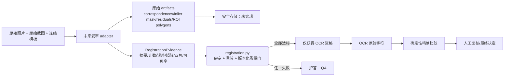

# 图像配准质量门：先决定“能不能读”，再让 OCR 读

## 1. 这一步解决什么

现有合成图片和模板是同尺寸、同布局的，固定 ROI 可以直接裁剪。真实“照片 A 对截图 A'”可能有透视、旋转、裁切和镜头偏移。如果仍用原坐标裁剪，就可能把 A 的一个字段错对到 A' 的另一个字段，甚至产生危险的“两边都读错但恰好相同”。

`registration.py` 首先实现的不是 OpenCV 算法，而是未来 adapter 必须满足的安全合同。独立对抗复审后，这个合同不再相信 adapter 自报的“成功”或四角位置：

- 源图、目标图和模板 SHA-256，以及受信解码器给出的图像尺寸，必须与冻结 Manifest/运行上下文的期望值完全一致；
- adapter ID/版本必须与版本化配置绑定；当前默认值明确叫做 `future-registration-adapter / contract-only-2`，只是未实现接口的占位标签，不是 OpenCV adapter 已获批的声明；字符串检查也不是代码签名或运行时证明；
- correspondence 原始集合的摘要、变换模型、变换矩阵、计数、误差和 ROI 可见率被纳入 evidence 内容哈希；
- `IDENTITY` 也不能以“数学上不需要估计参数”为由用 0 个匹配点通过；它仍需要质量证据，且矩阵必须真的是 identity；
- 本地检查 `IDENTITY / TRANSLATION / EUCLIDEAN / AFFINE / HOMOGRAPHY` 的矩阵系族语义，防止“声称 identity，矩阵却暗含平移/缩放”；
- 本地从 3×3 矩阵重算源图 `TL → TR → BR → BL` 四角，与 adapter 报告值逐点比对；
- 自交、凹四边形、重复点、零面积、顺序错乱、镜像翻转、透视地平线穿过源图的变换都会拒答；
- ROI 不只比较集合，还必须与冻结 Schema 的顺序完全一致；
- 任一失败都只能拒答并升级 QA；“可用于 OCR”不等于值相同，更不等于自动放行。

## 2. 数据流和信任边界

当前边界必须说清：`RegistrationEvidence` 是结构化报告，不是密码学证明。一个能任意构造 Python 对象的不受信调用者，仍然可以伪造“40 个匹配、34 个 inlier、误差 1.2 px、所有 ROI 100% 可见”。`correspondence_set_sha256` 只能绑定一个摘要，如果没有保留并复核对应的原始 artifact，它不能证明点集真实存在。

因此，未来 adapter 接入时至少还需要：

1. 从冻结 Manifest 读取原图/模板期望哈希，对实际解码的字节重算哈希并从受信解码器获取尺寸，而不是让 adapter 自己选期望值；
2. 在受信进程中产生并原子保留双向匹配点、去重后点集、inlier mask、每点 residual、模板 ROI 多边形和裁剪交集；
3. 验证 `matched_points` 真的是空间上不重复、不共线、来自正确模板与两张绑定图像的 correspondence；
4. 从原始 residual 本地重算 median/p95，从变换后 ROI 与图像边界交集本地重算 visibility；
5. 把 adapter 构建产物哈希、配置哈希、原始 artifact 哈希和评估结果一起进入追加式审计。

在这些接入完成前，当前门只适合合成 PoC 和接口合同测试。

## 3. 当前确定性检查

### 3.1 绑定和类型

- evidence 必须绑定 source image、target image、template 和 correspondence artifact 的小写 SHA-256；
- 评估函数另外强制接收冻结 Manifest 的三个期望哈希、受信解码尺寸和冻结配置哈希，不匹配就失败；
- `bool` 不能冒充 `int/float`；NaN、Infinity、超大图像尺寸、超大坐标和不可能的计数会在边界被拒绝；
- `-0.0` 统一规范为 `0.0`，避免语义相同记录产生不同哈希。

### 3.2 矩阵和几何

- 3×3 homography 的整体倍数没有几何意义，因此内容记录会对齐次尺度规范化；比如 `H` 与 `-2H` 获得同一哈希；
- 内容哈希使用固定 key 排序和 JSON 分隔符，但它仍是 PoC 内部规则，不是 RFC 8785/JCS 跨语言标准，也不是数字签名；跨运行时互操作必须另行规范化和验证；
- determinant 不使用可被任意齐次缩放改变的原始值。代码先把源/目标坐标归一化到无量纲坐标，再计算规范化 determinant；
- 矩阵在源图连续边坐标的 `TL, TR, BR, BL` 上本地做 perspective divide；分母为零、接近零或在四角之间变号时，表示 projective horizon 穿过图像，直接失败；
- 四角必须严格凸且顺序正确，adapter 报告四角与矩阵重算四角的最大距离不得超过固定安全上限；
- 边界采用“连续像素边”语义：宽高为 `(W, H)` 的图像外边界是 `(0, 0)` 到 `(W, H)`，因此 `W/H` 不是 off-by-one；等于允许越界量时通过，多一个 epsilon 就失败。

### 3.3 质量和 ROI

- matched point 数、inlier 绝对数和 inlier ratio 是三个独立门，避免少量点靠高 ratio 通过；
- median 和 p95 reprojection error 分开检查，避免中位数掩盖长尾误差；
- 映射面积、方向、四角越界和 ROI visibility 任一失败都不得进入 OCR；
- ROI ID 集合和顺序都必须与冻结 Schema 一致，评估结果另外绑定该有序列表的哈希；
- failure flags 按声明的固定顺序返回，不依赖 `set` 迭代顺序。

## 4. 配置不能把门槛调成“形同虚设”

旧版只检查“阈值是否非负”，因此调用者可以设置 `minimum_inlier_ratio=0`、极大误差上限或极低 ROI 可见率，把质量门配置成几乎必过。现在 `RegistrationConfig` 内建版本化 safety envelope：配置可以更严，不能比当前默认值更宽。

`assess_registration(...)` 还要求调用者提供来自冻结 pipeline 的期望配置哈希；运行配置的内容哈希不一致时也不得进入 OCR。这个控制的前提是“期望哈希来自受信、不可由请求者替换的 pipeline”；如果不受信调用者能同时选配置和期望哈希，字符串比对本身并不构成安全边界。

这些默认值是 PoC 的保守起点，**尚未经真实相机、面板、光照和 challenge set 校准**。“不允许运行时调弱”只防止明显配置绕过，不能证明这些数字已适用于生产。如果 development split 证据支持修订，应当评审并发布新的代码/配置 Schema 版本，不是在请求中临时传入宽松值。

## 5. 现在能与不能证明什么

当前代码能证明：

- 对一个给定的结构化 evidence，绑定、矩阵系族、本地几何、数值范围、ROI 完整性和阈值判定是确定性、失败闭锁的；
- 超大齐次矩阵、NaN/Infinity、`-0.0`、透视奇点、畸形四边形、错顺序 ROI、非法阈值以及 1001 个 ROI 契约都有对抗测试；
- `automatic_release_allowed` 恒为 `False`。

当前代码不能证明：

- adapter 真的对绑定图像运行了 OpenCV；
- correspondence 是真实、唯一、非共线且匹配到正确面板；
- median/p95、inlier mask 和 ROI visibility 没有被调用者伪造；
- adapter ID/版本字符串对应的就是某个经评审二进制；
- 阈值在真实现场图像上已校准；
- 本门已经接入 `vision_pipeline.py`、审计或 QA UI。

因此，它仍然是“先写安全合同和对抗测试”的设计里程碑，不是已完成的真实照片配准系统，也不是 GxP/监管验证证明。

## 6. 为什么没有直接安装 OpenCV

本项目尚未把配准合同连接到 OpenCV。新增原生依赖须先满足[供应链检查](./SUPPLY_CHAIN.md)，不能只凭根目录许可证判断是否可以引入。接入前还必须：

1. 固定具体发布版本和 wheel/hash；
2. 更新供应链注册表与 native 库清单；
3. 评估 Python 3.11/3.13 及 macOS CI/本机差异；
4. 用 development split 调参，不窥视 hidden/challenge；
5. 证明净收益高于依赖、构建、资源和攻击面成本。

## 7. 对零基础学习者的一句话

配准就是“先确认两张图的同一个位置真的对齐了”；质量门则是“证据不够或几何不自洽时必须承认不确定，不允许硬读”。
