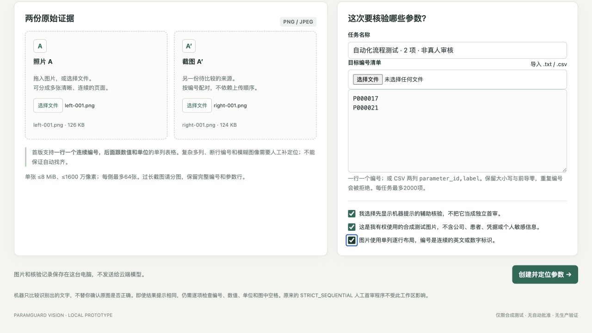
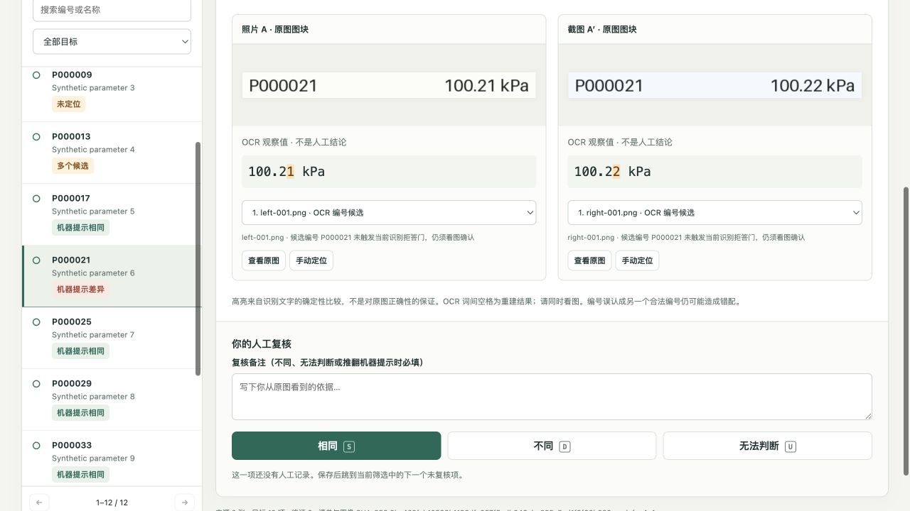
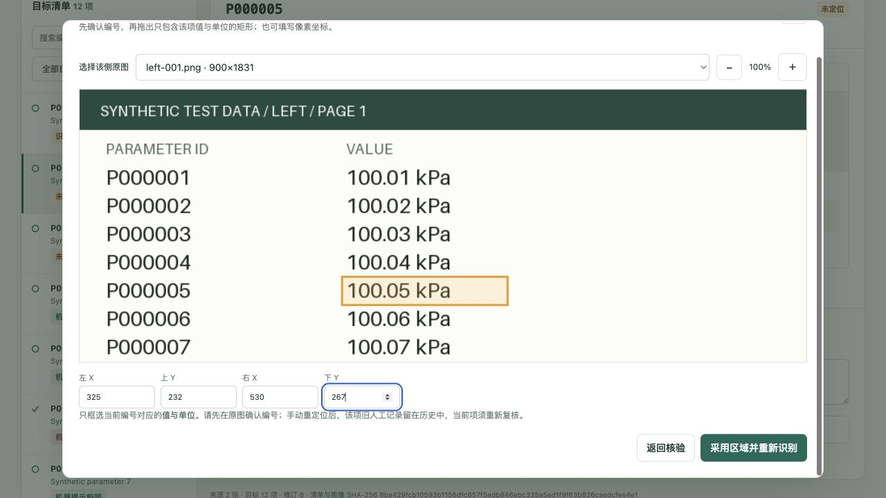
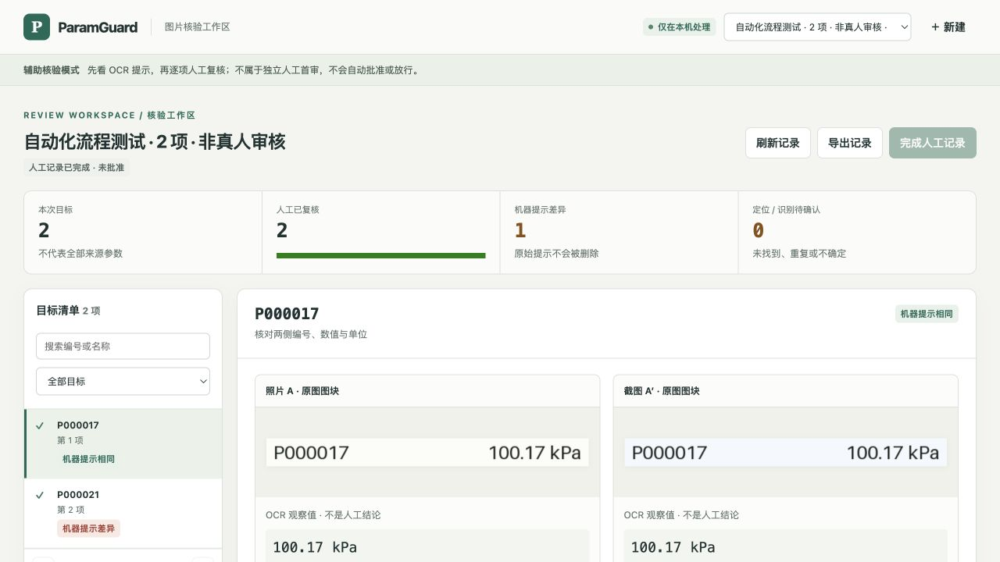

# 网页流程演示

下面是实际运行的 ParamGuard 页面，不是设计稿。图片由项目生成器制作并标记为合成测试数据；OCR 是本机 Tesseract 的真实输出。演示中的按钮操作由自动化执行，**不代表真人认真核验或授权审批**。

## 1. 上传图片、指定目标

可以上传自己的合成测试图，也可使用仓库样例：[照片 A](./fixtures/assisted/left-001.png)、[截图 A′](./fixtures/assisted/right-001.png)、[12 项目标清单](./fixtures/assisted/targets.csv)。这些是可下载的 PNG/CSV，不是预填 OCR 答案。



截图中的完整流程测试只选了 `P000017` 和 `P000021`，便于展示收口。另一次交互测试导入了完整 12 项 CSV，覆盖未定位、重复候选和手动定位。

## 2. 查看成对证据

系统保留目标清单，按编号寻找两边候选，把实际图片区域并排显示。机器提示和人工完成数是分开的：即使识别结束，人工完成数仍从 0 开始。



此项左侧是 `100.21 kPa`，右侧是 `100.22 kPa`。文字高亮来自确定性比较，不是模型生成的解释，也不能证明 OCR 一定正确。仍需对照图中的编号、数值和单位。

## 3. 自动定位失败后，自己选区域

12 项例子中，`P000005` 在两张图里存在，但全页 OCR 没有找到编号。页面仍保留这项。打开原图确认编号后，框选值与单位，重新运行局部 OCR。



本次实际重新识别得到左 `100.05 kPa`、右 `100.06 kPa`。记录会注明是手动区域；不会把它说成自动定位成功。重复的 `P000013` 也保留了两份左侧候选，必须显式选择，程序不会自动取最高置信分。

## 4. 逐项记录，完成后只读

在交互测试中，页面实际拒绝了没有原因的“不同”提交。两项流程测试逐项填写后，再确认完成记录；刷新仍能恢复两项记录。



完成后修改按钮禁用，机器差异仍为 1。状态明确为“人工记录已完成 · 未批准”，不是自动审核通过。JSON 导出包含目标、观察、记录和历史，不含图片文件，也不会上传云端。

## 运行相同页面

安装和输入限制见[工作区说明](../ASSISTED_WORKBENCH.md)。从仓库根目录运行：

```bash
python -m paramguard.assisted_web --port 8766 --workspace artifacts/my-workspace
```

打开 <http://127.0.0.1:8766/>，上传上面的两个样例文件并导入 CSV。GitHub 本页只能展示代码、图片和文档；上传、OCR 和核验交互需要在本机运行，不是 GitHub Pages 托管的服务。

如果需要先独立人工首审，使用 `python -m paramguard.webapp`；不要把此辅助页面的记录当成 R1。完整严格领域流程另有 `tools/full_workflow_demo.py`，它用真实本地 OCR 和明确标注的脚本化人工角色演示 R1 → 锁定 → OCR → 定向复核 → QA → 最终拒绝，不是生产批准流程。

所有展示资产均来自本项目合成输入。大规模运行的失败项和完整分母见[6000→1000 实测](../ASSISTED_BENCHMARK.md)。
